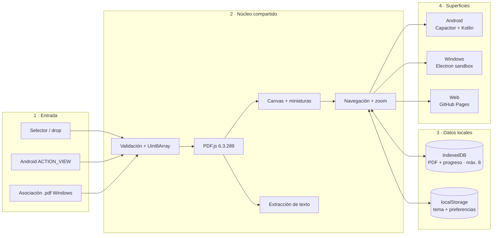
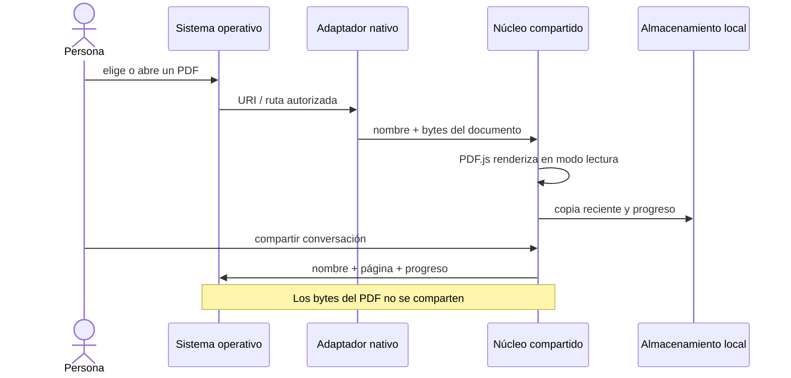

# Arquitectura

PDF Reader comparte el mismo motor y la misma experiencia en las tres plataformas. Android y Windows agregan adaptadores deliberadamente pequeños para conversar con el sistema operativo; ninguna plataforma mantiene una implementación paralela del lector.

## Límites de confianza

## Decisiones

- **Vanilla JS:** menos abstracción para un lector pequeño, superficie reducida y fácil auditoría.
- **PDF.js:** motor consolidado y multiplataforma para render de PDF. La versión inicial fijada es `6.3.289` y el build usa la variante `legacy` para ampliar compatibilidad con WebView Android, además de CMaps/fuentes estándar cuando están disponibles.
- **Electron:** da asociación `.pdf`, instalador Windows y experiencia desktop.
- **Capacitor:** reutiliza la misma UI en Android con shell nativo.
- **Puentes mínimos:** Android aporta intents y la hoja de compartir; Windows aporta diálogos y configuración del sistema. El dominio permanece en JavaScript compartido.
- **Sin backend:** no hay servidor, identidad, sincronización ni telemetría. La frontera de datos termina en el dispositivo.

## Mapa de componentes

| Componente | Rol | Datos que maneja |
|---|---|---|
| `src/app.js` | Orquesta lector, gestos, vistas y capacidades de plataforma | Documento activo y estado de UI |
| `src/history-store.js` | Encapsula IndexedDB y limita el historial | Bytes, nombre y progreso de hasta ocho PDF |
| `src/utils.js` | Funciones puras testeables | Cálculos de zoom, páginas y gestos |
| `PdfIntentPlugin.java` | Traduce un intent Android en una carga explícita | URI autorizada y bytes del PDF |
| `desktop/preload.cjs` | Expone IPC mínimo al renderer aislado | Apertura de archivo y preferencias del sistema |
| `.github/workflows/` | Verifica y distribuye cada superficie | APK firmado, instaladores, Pages y SHA-256 |

## Estado local

`localStorage` guarda tema y estado de lectura por huella simple (`nombre + tamaño + mtime`). IndexedDB conserva hasta ocho PDF recientes con metadatos y progreso para reabrirlos en Android, Windows o web. La persona puede eliminar una entrada o borrar el historial completo.

## Límites

El documento se carga en memoria y una copia puede persistirse en IndexedDB. La cuota la decide el dispositivo y un fallo de persistencia no impide leer. PDF extremadamente grandes pueden requerir más RAM. El streaming parcial queda fuera de `v0.2.0`.

`@capacitor/share` conecta la acción explícita de compartir con la hoja nativa de Android. La capa web usa `navigator.share` y, cuando no está disponible, abre WhatsApp Web. El mensaje nunca contiene los bytes del PDF.
