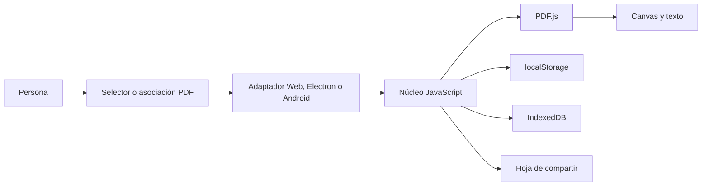

# 01. Descripción general del sistema

## Qué es y qué problema resuelve

PDF Reader es un lector local y de solo lectura para Android 7+, Windows y navegador. Reduce el uso a abrir, leer, navegar y buscar, evitando herramientas de edición que podrían modificar accidentalmente el original. No tiene backend, cuentas, publicidad ni telemetría.

Está dirigido principalmente a personas que quieren una interfaz sencilla en móvil o escritorio. Los casos de uso comprobados son: abrir un PDF local; navegar por página, miniatura o gesto; ajustar zoom y rotación; buscar texto; reanudar hasta ocho lecturas recientes; compartir nombre y progreso; y elegir la aplicación como lector `.pdf` predeterminado.

## El sistema explicado para una persona no técnica

La aplicación recibe solamente el archivo que eliges. Lo dibuja en pantalla sin cambiarlo y recuerda localmente dónde estabas. Android y Windows aportan la ventana o selector de archivos; el lector interior es el mismo en las tres plataformas. Cuando compartes, se envía un mensaje con el nombre y la página, no el documento. El historial se puede borrar y los originales nunca son eliminados por la aplicación.

## Actores, entradas y salidas

| Elemento | Descripción comprobada |
|---|---|
| Persona lectora | Elige el PDF, controla vista, historial y compartir |
| Mantenedor | Construye, prueba, firma y publica versiones |
| Sistema operativo | Entrega archivos y ofrece selección de app/compartir |
| Entrada principal | Bytes y metadatos del PDF elegido o recibido por asociación |
| Salida visual | Página rasterizada en `<canvas>`, miniaturas y resultados |
| Salida persistente | Preferencias y hasta ocho copias/progresos locales |
| Salida externa | Texto de progreso entregado a la hoja de compartir |

## Componentes y tecnologías

- HTML, CSS y JavaScript sin framework para la interfaz y orquestación.
- Mozilla PDF.js `6.3.289` para decodificar, renderizar y extraer texto.
- IndexedDB para copias recientes; `localStorage` para tema y estado de lectura.
- Electron `44.0.0` y electron-builder `26.15.3` para Windows.
- Capacitor `8.5.0`, `@capacitor/share` `8.0.1`, Java y Gradle para Android.
- Node.js 22+ y pnpm 11.19.0 para scripts y dependencias.
- GitHub Actions para CI, Pages y releases por tag.

## Flujo general

El adaptador entrega bytes autorizados al núcleo; PDF.js construye el documento; `app.js` calcula la vista y dibuja la página; el progreso se guarda localmente. La búsqueda extrae texto página por página. No existe tráfico hacia un API del producto.

## Límites y estado observado

No edita, firma, anota, aplica OCR ni sincroniza PDF. Los documentos protegidos con contraseña no tienen diálogo dedicado. Cada PDF se carga completo en memoria y la persistencia depende de la cuota del dispositivo. Windows no tiene firma Authenticode; Android se distribuye como APK firmado desde GitHub Releases, no desde Play Store.

El estado `0.3.1` es reproducible para el alcance comprobado: 24/24 pruebas Node, verificador, build de Pages, APK debug y paquetes Windows aprobaron el 2026-09-24. El tag `v0.3.1` publicó un APK firmado, dos ejecutables Windows y checksums mediante un workflow remoto verde. Las pruebas físicas Android siguen declaradas como no ejecutadas.
