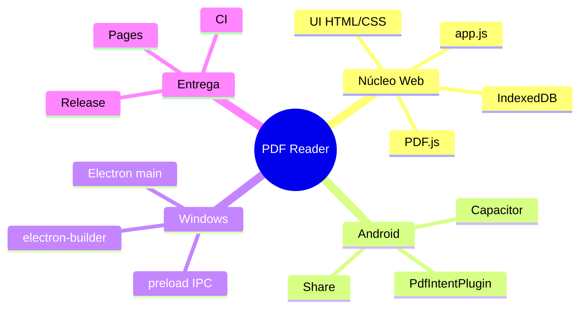
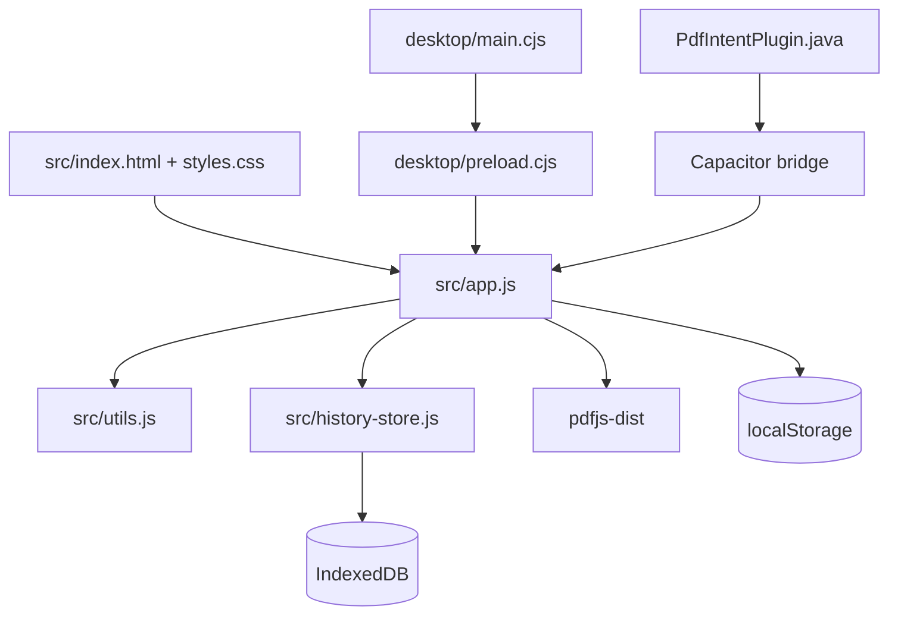
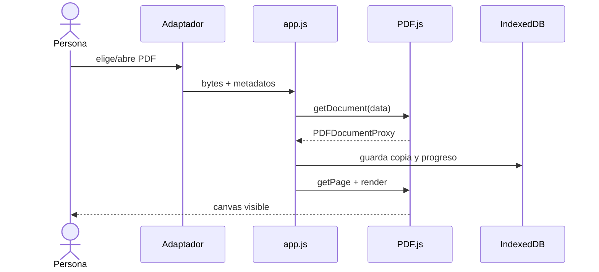
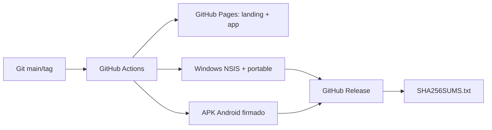

# 03. Arquitectura

## Estilo y principios

La arquitectura es un núcleo Web compartido con adaptadores nativos delgados. No hay backend ni base de datos remota. El diseño favorece pocas capas auditables: presentación/orquestación, motor PDF, persistencia local y puentes de plataforma. El ADR `docs/adr/0001-cross-platform-shells.md` registra esta decisión.

## Componentes y dependencias

`app.js` mantiene un único estado de sesión y enlaza eventos DOM. PDF.js se carga como módulo/worker local. `history-store.js` encapsula transacciones IndexedDB. Electron expone solo cinco operaciones por `contextBridge`; Android registra un plugin que lee la URI autorizada y devuelve Base64.

## Secuencia de apertura

## Estado, asincronía y errores

El objeto `state` concentra documento, archivo, página, zoom, ajuste, rotación, tarea de render, caché de texto y gestos. Las operaciones PDF/IndexedDB son promesas. `renderSeq` y la cancelación de `renderTask` evitan que un render anterior sobrescriba al más reciente. Los errores de contraseña/formato se traducen a mensajes de usuario; un fallo de persistencia no impide leer.

No hay colas, workers propios ni procesos de fondo aparte del worker de PDF.js y los jobs de CI. Miniaturas y búsqueda ceden control al navegador periódicamente con `requestAnimationFrame`.

## Autenticación, autorización y confianza

No existen usuarios, sesiones ni roles. La autorización de archivo la concede el selector del sistema o una asociación explícita. Electron aísla el renderer (`contextIsolation`, sin Node, sandbox). Android no declara Internet ni almacenamiento general. El contenido PDF se considera no confiable y queda dentro de PDF.js/renderer.

## Despliegue

`ci.yml` valida Web, Windows y Android; `pages.yml` despliega desde `main`; `release.yml` produce binarios al etiquetar. No se identificaron contenedores, infraestructura cloud propia, caché remota ni observabilidad de runtime.

## Decisiones y consecuencias

- Vanilla JS reduce dependencias y jerarquía, pero `app.js` concentra demasiadas responsabilidades.
- Compartir el núcleo garantiza paridad, pero hereda límites de WebView y memoria.
- Persistir bytes facilita reanudar sin permisos amplios, pero consume cuota IndexedDB.
- No tener backend minimiza exposición y operación, a costa de no sincronizar dispositivos.
