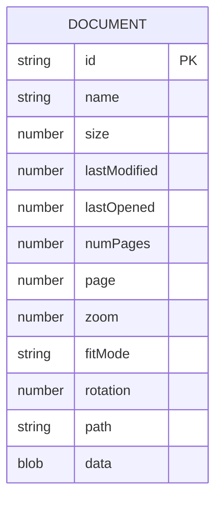

# 07. Persistencia y diccionario de datos

## Mecanismo

No existe una base de datos de servidor ni SQL. La persistencia se divide entre IndexedDB y `localStorage` del navegador/WebView/Electron. Todos los datos permanecen en el dispositivo bajo el origen de la aplicación.

## IndexedDB

| Propiedad | Valor |
|---|---|
| Base | `pdf-reader-local` |
| Versión | `1` |
| Object store | `documents` |
| Clave primaria | `id` (`keyPath`) |
| Índice | `lastOpened` |
| Límite de aplicación | 8 documentos, aplicado tras guardar |

### Diccionario

| Campo | Tipo observado | Obligatorio | Uso/regla |
|---|---|---|---|
| `id` | string | Sí | `pdf:` + nombre codificado + tamaño + fecha |
| `name` | string | Sí | Nombre mostrado y compartido |
| `size` | number | Sí | Bytes y presentación |
| `lastModified` | number | Sí | Identidad; Android externo usa 0 |
| `lastOpened` | number | Sí | Epoch ms para ordenar/podar |
| `numPages` | number | Tras abrir | Estado/UI |
| `page` | number | Sí | Se limita a `1..numPages` al restaurar |
| `zoom` | number | Sí | Se limita a `0.35..5` |
| `fitMode` | string | Sí | `width`, `page` o `manual` |
| `rotation` | number | Sí | `0`, `90`, `180` o `270` |
| `path` | string/undefined | No | Solo continuidad Electron |
| `data` | Blob/bytes | No | Copia local; se omite al listar |

`stored` no se persiste: `listHistory` lo deriva de la existencia de `data`. En Windows una entrada con `path` puede reabrirse incluso sin Blob.

## Operaciones e integridad

- `listHistory`: `getAll`, orden descendente y oculta bytes.
- `getHistoryDocument`: lectura por clave.
- `saveHistoryDocument`: upsert y poda por `lastOpened`.
- `updateHistoryDocument`: fusiona parche conservando `id`.
- `removeHistoryDocument`: elimina una entrada.
- `clearHistory`: borra el store completo.

La integridad depende de validación de `app.js`; IndexedDB no impone esquema, tipos ni restricciones. No hay migraciones posteriores a versión 1, respaldo, cifrado adicional ni sincronización. La recuperación consiste en volver a abrir el original; borrar datos del sitio/desinstalar elimina el historial.

## `localStorage`

| Clave | Contenido |
|---|---|
| `theme` | `light` o `dark` |
| `pdf-state:<nombre>:<size>:<mtime>` | JSON con página, zoom, ajuste y rotación |
| `default-reader-prompted:0.3.0` | `1` tras mostrar/decidir el aviso |

## Sensibilidad y riesgos

Los PDF pueden contener datos personales o confidenciales. IndexedDB almacena copias sin cifrado propio; la protección depende del sistema operativo/perfil. No hay política automática por antigüedad, solo límite de ocho. La identidad no es un hash del contenido y puede colisionar. La cuota es variable y una escritura fallida se degrada a lectura sin historial.
