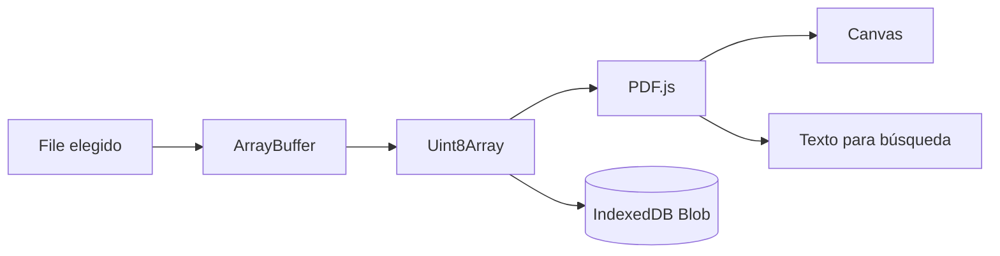
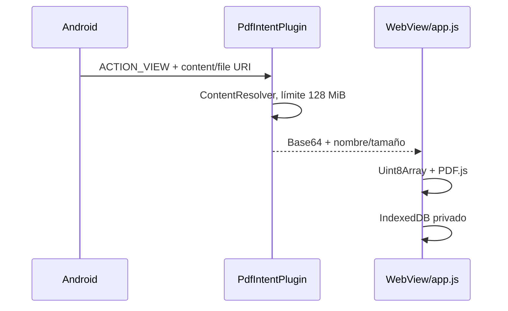

# 08. Flujo de datos

## Apertura Web

El `<input>` o drag/drop entrega un `File`. Se valida extensión/MIME, se carga completo y se pasa a PDF.js. No se transmite a red. Nombre, tamaño y fecha se usan para identidad/progreso.

## Apertura Windows

Electron muestra un diálogo o recibe asociación `.pdf`. El proceso principal valida extensión, lee bytes y los cruza por IPC aislado. El renderer normaliza esos bytes y conserva la ruta para reabrir. El acceso no se limita a una lista de directorios, pero solo existe una operación explícita de lectura `.pdf`.

## Apertura Android

El plugin consume el intent para evitar reapertura duplicada. Base64 aumenta memoria/transporte; no se conserva la URI. La selección normal del `<input>` usa el selector del WebView.

## Render y navegación

PDF.js entrega un viewport y pinta en canvas. Página/zoom/ajuste/rotación cambian en memoria y luego se guardan. El DPR se limita a 2. Miniaturas usan escalado `0.19`; texto se normaliza y se cachea por página hasta cambiar de documento.

## Búsqueda

Consulta -> minúsculas locales -> recorrido secuencial -> coincidencia por página -> snippet -> escape HTML -> `<mark>` -> botón de resultado. No hay OCR: un escaneo sin capa de texto no producirá coincidencias.

## Compartir

La app construye un texto con nombre del archivo, página, total y URL pública. Android usa `@capacitor/share`; Web usa `navigator.share`; el fallback abre `wa.me`. Nunca incluye bytes del PDF. El nombre puede ser sensible y solo sale tras una acción explícita.

## Eliminación

Eliminar una lectura borra su fila IndexedDB; borrar historial limpia el store tras confirmación. Los estados `localStorage` por documento no se eliminan en ese flujo. Los originales externos nunca se borran.

## Puntos de fallo o inconsistencia

| Punto | Consecuencia | Tratamiento actual |
|---|---|---|
| PDF corrupto/cifrado | No abre | Mensaje amigable |
| Falta de cuota IndexedDB | Sin continuidad | Lectura sigue y muestra aviso |
| Documento grande | Alta RAM/copia Base64 | Límite 128 MiB solo para intent Android |
| Mismo nombre/tamaño/mtime | Progreso compartido | No mitigado |
| Fallo entre `put` y poda | Más de 8 filas | Se corrige en guardado posterior |
| Cierre durante guardado | Progreso previo | Transacción IndexedDB atómica por operación |
