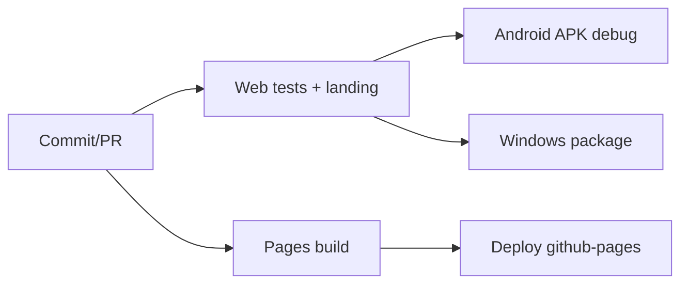

# 13. Despliegue y operación

## Canales

| Canal | Fuente | Salida |
|---|---|---|
| GitHub Pages | push a `main` | landing `/` y lector `/app/` |
| CI | push/PR a `main` | evidencia y artifacts de preview |
| GitHub Release | tag `v*` | APK firmado, EXE y checksums |
| Local Web | `pnpm start:web` | servidor 4173 sin caché |

No hay servidores persistentes, contenedores, migraciones de infraestructura ni base de datos central.

## Pipeline CI

CI cancela ejecuciones anteriores de la misma referencia. Web instala con lockfile, prueba, audita dependencias de producción, construye Pages y sube preview. Android depende de Web, sincroniza, exige que `android/` no cambie, compila tests/APK y revisa paquete, versión y permisos. Windows empaqueta dos EXE.

## Release

1. actualizar marcadores actuales y notas `docs/releases/vX.Y.Z.md`;
2. ejecutar `pnpm release:check`;
3. fusionar a `main` con checks verdes;
4. crear y empujar tag exacto `vX.Y.Z`;
5. `preflight` verifica contrato;
6. Android reconstruye, firma y audita APK;
7. Windows genera instalador/portable;
8. `publish` calcula SHA-256 y crea/actualiza GitHub Release.

Los secrets de firma solo existen en el job Android y el keystore se reconstruye en `$RUNNER_TEMP`. Los artifacts intermedios se fusionan antes de publicar.

## Operación

La aplicación no emite métricas, logs remotos ni alertas. Diagnóstico: consola del navegador/Electron, logs Android/Gradle y GitHub Actions. El estado del usuario es local; no hay backup gestionado por el producto.

## Rollback

- Pages: corregir `main` o redeplegar un commit conocido mediante workflow; no reescribir historia protegida.
- Release fallido antes de publicar: corregir `main` y recrear solo un tag no publicado.
- Release público defectuoso: publicar una versión nueva; no reescribir tags ni cambiar clave Android.
- Datos locales: la recuperación consiste en reabrir originales; no existe restauración central.

## Mantenimiento

- revisar PR de Dependabot y ejecutar todos los gates;
- mantener Node/JDK/SDK/pnpm sincronizados entre docs y workflows;
- comprobar expiración/custodia de certificados y backups cifrados del keystore;
- verificar manualmente un APK/EXE descargado y sus hashes;
- probar PDF representativos sin datos sensibles en cada plataforma.

## Alertas y responsabilidades

No se identifican SLA, on-call ni alertas automáticas. GitHub informa fallos de Actions según preferencias del mantenedor. El runbook recomienda Issues reproducibles y Security Advisories para vulnerabilidades.
