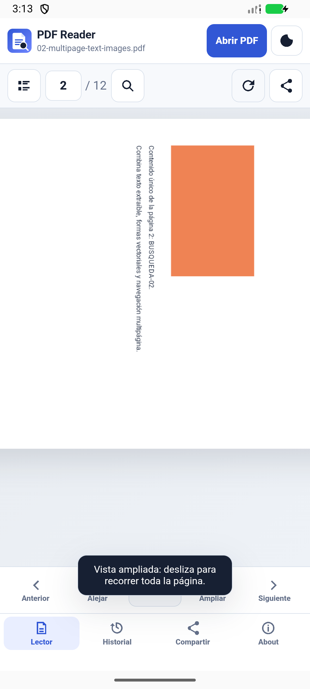
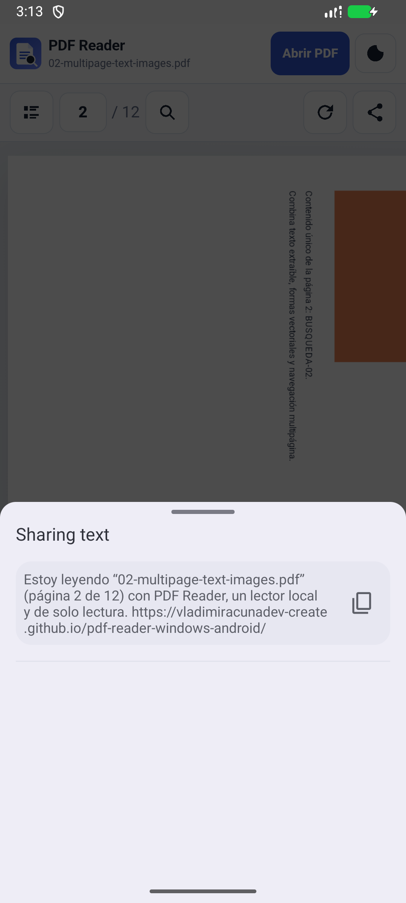

# Evidencia de release v0.3.3

Estado: **PUBLICADO; ARTEFACTOS DESCARGADOS Y VERIFICADOS; COBERTURA FUNCIONAL CON LÍMITES EXPLÍCITOS** el 2026-09-29. Release: https://github.com/vladimiracunadev-create/pdf-reader-windows-android/releases/tag/v0.3.3. Commit/tag: `366a27ca6cceadf3599758a872cc920e4f939850` / `v0.3.3`.

## Evidencia previa al tag

| Gate | Estado inicial |
|---|---|
| Versión coordinada (`package.json`, app, Android, sitio y docs) | PASS · `0.3.3`, Android `versionCode 6`; el probe deja solo referencias históricas 0.3.2 y un falso positivo dentro de `release-evidence-v0.3.2.md`, revisado manualmente |
| Pruebas Node y estructura | PASS · 29/29 Node, estructura y 20 Markdown/20 PDF |
| Electron E2E | PASS · 47/47 sobre aplicación real y 47/47 sobre `win-unpacked` v0.3.3 |
| Web localhost E2E | PASS · 21/21 Edge/Chromium, viewport móvil 390×844 |
| Android Emulator E2E | PASS · 21/21 sobre APK debug v0.3.3 instalada desde cero, API 36.1 |
| Corpus PDF | PASS · 16 variantes por selector Web/Electron y DocumentsUI Android |
| CI/Pages | PASS · CI `36514689572` (tres jobs) y Pages `36514689616` |
| Release workflow y artefactos publicados | PASS · `36514950301`, contrato, Android firmado, Windows y publicación |
| Instalación desde descarga pública | PASS · Portable 47/47, Setup instalado 47/47, APK firmado con flujos críticos black-box |
| Android físico | **NO EJECUTADO** |

La repetición Android de instalación limpia expuso que el diálogo de lector predeterminado absorbía el primer gesto del harness y que la descripción del WebView podía consultarse antes de estabilizar los insets. Se corrigió el harness para esperar el WebView, releer sus bounds y cerrar explícitamente **Ahora no**; la suite completa posterior terminó 21/21. Un intento inicial de DocumentsUI no localizó el PDF dentro de su ventana acotada de reintentos; la repetición conservando la misma instalación limpia recorrió las 16 variantes y terminó PASS. No se convirtió ese intento fallido en evidencia verde.

## Automatización remota

| Ejecución | Resultado |
|---|---|
| [CI `36514689572`](https://github.com/vladimiracunadev-create/pdf-reader-windows-android/actions/runs/36514689572) | PASS · Web, Android debug y Windows package |
| [Pages `36514689616`](https://github.com/vladimiracunadev-create/pdf-reader-windows-android/actions/runs/36514689616) | PASS · landing y aplicación Web v0.3.3 |
| [Release `36514950301`](https://github.com/vladimiracunadev-create/pdf-reader-windows-android/actions/runs/36514950301) | PASS · tag contract, APK firmado, Setup, Portable, checksums y publicación |

## Descarga exacta del release

Los cuatro archivos se descargaron en un directorio nuevo mediante `gh release download v0.3.3`. Los hashes locales coinciden con `SHA256SUMS.txt` y con el digest que publica GitHub.

| Artefacto público | Bytes | SHA-256 | Resultado posterior a descarga |
|---|---:|---|---|
| `PDF-Reader-Android-v0.3.3.apk` | 6232729 | `81b3ed408c8973889e738b0a01dcfb1094b653985661b524804620ccd27eadd2` | PASS · firma, metadatos, instalación limpia y flujos críticos |
| `PDF-Reader-Windows-0.3.3-x64-Portable.exe` | 128540989 | `d2065cb4f281ef9d107b96ea3fc95e1884c30afdeea20ead576fb443969e6480` | PASS · ejecutado directamente; 47/47 E2E |
| `PDF-Reader-Windows-0.3.3-x64-Setup.exe` | 128764612 | `0adcea8f969cca83f304f8e5ddf5e38d8c0c11a65a84ff542166b9d2f9719871` | PASS · instalación silenciosa aislada, 47/47 E2E y desinstalación exitosa |
| `SHA256SUMS.txt` | 315 | `b443dbf97b0f18c3cf129fc689fb29be4a405c26e4116de4af4450bd35073267` | PASS |

### APK firmado publicado

- Paquete `cl.vladimiracunadev.pdfreader`, `versionName=0.3.3`, `versionCode=6`, min SDK 24, target/compile SDK 36.
- Firma APK Signature Scheme v2/v3, RSA 4096; certificado SHA-256 `8005f1d679b970f43f0c627ff3b668daafa3a4af9c7abbe6afa7cb19b2cb1a12`.
- Solo declara `DYNAMIC_RECEIVER_NOT_EXPORTED_PERMISSION`; no declara Internet ni permisos generales de almacenamiento.
- Se desinstaló la build debug y se instaló desde cero el APK descargado en Android Emulator API 36.1.
- PASS black-box: splash/primer inicio, aviso de lector predeterminado, DocumentsUI, PDF de 12 páginas, insets (`WebView [0,63]`), objetivos táctiles, Siguiente → Zoom+ → Zoom+ → Rotar, orientación horizontal, background/foreground conservando página 2 y zoom 74 %, y hoja nativa de compartir.
- Evidencia publicada y versionada: `reports/evidence/v0.3.3/android-release/`; las siete capturas enlazadas abajo proceden de la instalación limpia del APK descargado del release.
- La build release no habilita CDP. Los 21 casos instrumentados se ejecutaron 21/21 sobre la APK debug del mismo commit; sobre la APK firmada se repitió por UI black-box el conjunto crítico anterior.

### Capturas Android del artefacto público

| Paso observable | Captura |
|---|---|
| Primer inicio y aviso de lector predeterminado | [android-release-first-run.png](evidence/v0.3.3/android-release/android-release-first-run.png) |
| Selector nativo DocumentsUI | [android-release-picker.png](evidence/v0.3.3/android-release/android-release-picker.png) |
| PDF abierto desde el selector | [android-release-reader-open.png](evidence/v0.3.3/android-release/android-release-reader-open.png) |
| Secuencia compuesta: página 2, zoom y rotación | [android-release-composite.png](evidence/v0.3.3/android-release/android-release-composite.png) |
| Orientación horizontal | [android-release-landscape.png](evidence/v0.3.3/android-release/android-release-landscape.png) |
| Regreso de background conservando estado | [android-release-after-background.png](evidence/v0.3.3/android-release/android-release-after-background.png) |
| Hoja nativa de compartir | [android-release-share-sheet.png](evidence/v0.3.3/android-release/android-release-share-sheet.png) |

## Superficies públicas

- GitHub Release `v0.3.3` es el latest, no draft y no prerelease.
- GitHub Pages respondió HTTP 200; landing contiene `v0.3.3` y el enlace al APK v0.3.3; `/app/` muestra About 0.3.3.
- El About del repositorio se actualizó y releyó por API: descripción v0.3.3, homepage correcta y once topics conservados.

## Criterio de cierre satisfecho

Se completaron los ocho pasos exigidos:

1. limpieza y build reproducible: PASS;
2. suite local completa sobre aplicaciones reales: PASS;
3. integración en `main` y CI/Pages verdes: PASS;
4. tag `v0.3.3` y workflow de Release verde: PASS;
5. descarga nueva de APK, Setup, Portable y checksums: PASS;
6. verificación de versión, contenido, firma y hashes: PASS;
7. instalación limpia y repetición sobre artefactos descargados: PASS;
8. informe final con commit, run IDs, hashes y resultados: PASS.

## Límites que no se convertirán en PASS

- Teléfono Android físico: **NO EJECUTADO** mientras no exista un dispositivo físico conectado y probado.
- Fallback Web hacia servicios externos: **NO EJECUTADO** sin autorización para salida de datos.
- La ausencia de firma Authenticode en Windows es una limitación conocida, no una prueba aprobada.
